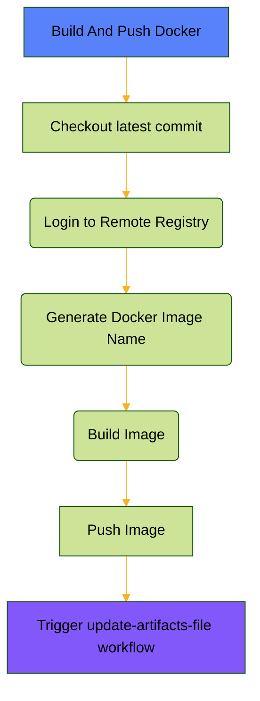
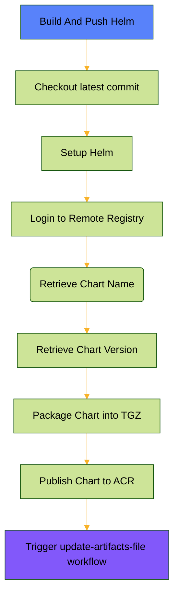
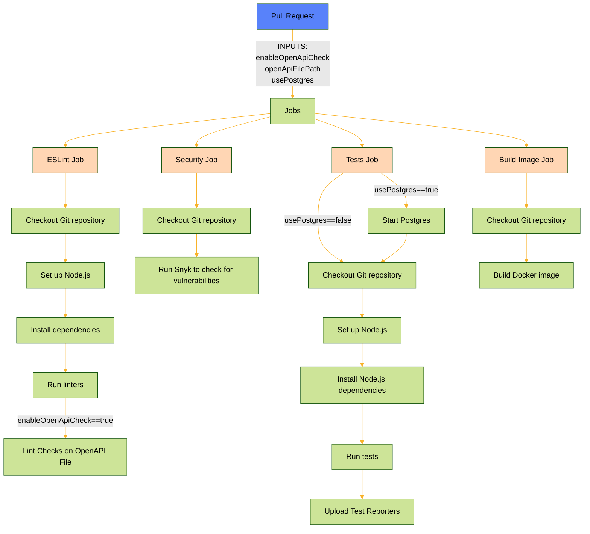
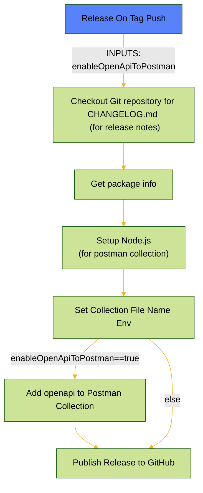
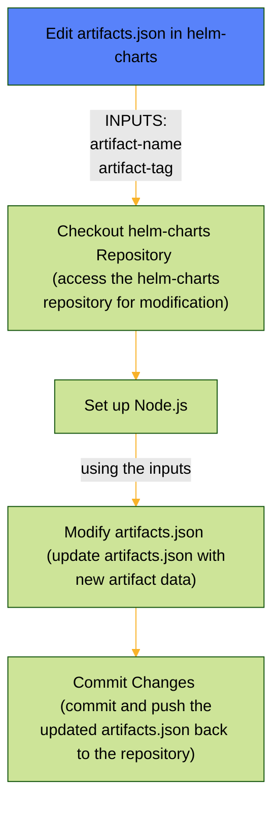

# shared-workflows

In this repository we can find reusable workflows that can be used from within other repositories in this organization.
Here's the shared workflows we can find in this repository:

## 1. build-and-push-docker
This workflow builds a docker image and and pushes it to the registry.
This workflow also utilizes `update-artifact-file` workflow, to edit the `artifacts.yaml` file in the [common helm charts](https://github.com/mapcolonies/helm-charts/) repository.
### Workflow parameters:
| Name       | Description                                                               | Type   | Required? | Default Value |
|------------|---------------------------------------------------------------------------|--------|-----------|---------------|
| scope         | This is the subdirectory in the helm-charts repository: `helm-charts/<scope>` | string | no       |   ''
| repository | If you want to override default's docker image name                       | string | no        |               |
| context    | From where the CI should build the docker image                           | string | no        | . (Current context)             |

## 2. build-and-push-helm
This workflow package a helm chart and and pushes it to the registry.
This workflow also utilizes `update-artifact-file` workflow, to edit the `artifacts.yaml` file in the [common helm charts](https://github.com/mapcolonies/helm-charts/) repository. 

Helm chart's name and version are inferred automatically from the `Chart.yaml` file.
### Workflow parameters:
| Name       | Description                                                               | Type   | Required? | Default Value |
|------------|---------------------------------------------------------------------------|--------|-----------|---------------|
| scope         | This is the subdirectory in the helm-charts repository: `helm-charts/<scope>` | string | no       |  ''

## 3. pull_request
This workflow should be used in your pull requests; here linters run, Snyk checks for vulnerabilities, tests of the service, and a dummy docker build to check that docker image can be still built and hasn't broken.

### Workflow parameters:
| Name               | Description                                              | Type    | Required? | Default Value   |
|--------------------|----------------------------------------------------------|---------|-----------|-----------------|
| enableOpenApiCheck | Flag to enable OpenAPI lint checks                       | boolean | no        | true            |
| openApiFilePath    | Path to the OpenAPI file (if enableOpenApiCheck is true) | string  | no        | ./openapi3.yaml |
| usePostgres    | Flag whether to initiate postgres service or not             | boolean | no        | false           |

## 4. release-on-tag-push
This workflow creates a release. Its trigger event should be when a new tag is craeted in the repository. This workflow generates postman collection for the service, and modifies the `CHANGELOG.md` file respectively.

### Workflow parameters:
| Name               | Description                                              | Type    | Required? | Default Value   |
|--------------------|----------------------------------------------------------|---------|-----------|-----------------|
| enableOpenApiToPostman | Flag to enable OpenAPI to Postman collection conversion                       | boolean | no        | true            |

## 5. update-artifacts-file
This workflow edits the `artifacts.json` according to the input.

### Workflow parameters:
| Name          | Description                            | Type                                  | Required? | Default Value |
|---------------|----------------------------------------|---------------------------------------|-----------|---------------|
| scope         | This is the subdirectory in the helm-charts repository: `helm-charts/<scope>` | string | no       | ''              |
| type          | Artifact`s type                        | string                                | no        | docker        |
| artifact-name | Artifact`s name                        | string                                | yes       |               |
| artifact-tag  | Aritfact`s tag                         | string                                | yes       |               |

